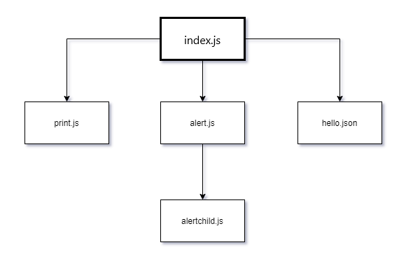

# PreEmptive Protection JSDefender Samples

This sample project demonstrates how you can use the JSDefender Rollup plugin to protect code that builds with Rollup version 2+. The code in this demo utilizes fundamental Rollup features, such as plugins, style, image, and vendor module loading, simple and nested dynamic imports.

The program contains five source files with these dependencies among them:



The Rollup configuration creates a separate chunk for each file. The `index.js` file is the entry chunk, it loads the other chunks on demand.

- The [original](original) folder contains the *unprotected* version of the code.
- You can discover [protected](protected) folder to examine the project that leverages JSDefender.

> **Note**: All further explanations assume you use the `protected` folder as the root project directory.

## Setting up the JSDefender Toolset

1. If you have not done yet, install [JSDefender](https://www.preemptive.com/products/jsdefender/downloads) on your machine.
1. Copy the `jsdefender-core-<version>.tgz` and `jsdefender-webpack-plugin-<version>.tgz` files from your download directory to the [`assets`](protected/assets/) folder of this demo. Here, `<version>` represents your downloaded JSDefender version number.
1. Replace the `{version}` placeholders within the `"devDependencies"` section in [`package.json`](protected/package.json) based on the version of your `*.tgz` files.

## Build and Run the Sample

1. Run `npm install` to set up the dependencies to run this project.
2. Run `npm run build` to create the JSDefender-protected Rollup bundles and put them into the `dist` folder. (Note, this task generates several dozen output lines.)
3. The project comes with a development server configured, the only thing you have to do is navigate to `http://localhost:10001` in your browser. The app should display a simple screen with three buttons:


4. Open the Developer Tools in your browser. As you click the buttons, those write messages to the console output.

## How It Works

This project uses the `JSDefenderRollupPlugin` that invokes JSDefender as the last step of the build process. The sample uses this `rollup.config.js` file:

```javascript
import html from "@rollup/plugin-html";
import image from "@rollup/plugin-image";
import json from "@rollup/plugin-json";
import serve from "rollup-plugin-serve";
import embedCSS from "rollup-plugin-embed-css";
import JSDefenderRollupPlugin from "@preemptive/jsdefender-rollup-plugin";

const jsdConfig = {
  configurationFile: "jsdefender.config.json",
  quietMode: false,
};

export default {
  input: ["src/home.js"],
  output: {
    dir: "dist",
    format: "es",
  },
  preserveEntrySignatures: false,
  plugins: [
    html(),
    image(),
    json(),
    embedCSS(),
    JSDefenderRollupPlugin(jsdConfig),
    serve("dist"),
  ],
};
```

The most relevant part of this file is the `plugins` section that sets up the `JSDefenderRollupPlugin`. It reads the protection configuration from the `jsdefender.config.json` file, which you can find in the project's root folder. By setting `quietMode` to false, the plugin displays log messages while Rollup runs:

```
[Info] JSDefenderRollupPlugin: Preemptive Protection JSDefender(TM) (v2.2.0)
[Info] JSDefenderRollupPlugin: Copyright 2019-2020 PreEmptive Solutions, LLC. All Rights Reserved
[Info] JSDefenderRollupPlugin: Use of this software constitutes acceptance of the accompanying license agreement.
[Info] JSDefenderRollupPlugin: Processing the following chunks: [index.js,styles-0deb3d90.js,print-21833182.js,alert-0ec61d6b.js,hello-b1250bd7.js,alertchild-dc553c16.js] with destination: dist
[Info] Licensed to: bprox@preemptive.com
Floating Build License: ############################47B2
This software may be used on binaries for general release.
[Info] Source tree building in progress...
[Info] Source tree successfully built.
[Info] Total length: 48056
[Info] #of scripts: 9
[Info] #of syntax nodes: 1119
[Info] Highest ES version: ES2015
[Info] Debugger removal transformation applied.

(some messages omitted for the sake of brevity)

[Info] Self-defending function transformation applied.
[Info] Rendering protected files...
[Info] Protected files rendered successfully.
http://localhost:10001 -> D:\Devel\JSDefender\Rollup\dist
[Info] JSDefenderRollupPlugin: All chunks have been protected successfully.
```

## Differences from the Original Code

- [`package.json`](protected/package.json): new `devDependencies` entries for JSDefender packages
- [`rollup.config.js`](protected/rollup.config.js): the configured `JSDefenderRollupPlugin` in the `plugins` section
- [`jsdefender.config.json`](protected/jsdefender.config.json): The JSDefender configuration file
