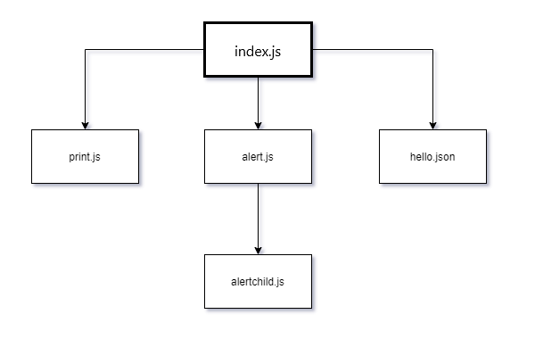
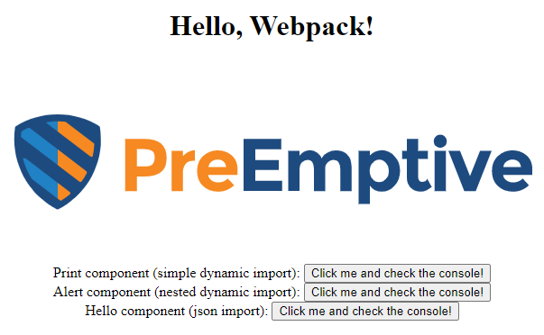

# PreEmptive Protection JSDefender Samples

This sample project demonstrates how you can use the JSDefender Webpack plugin to protect code that builds with Webpack4. The code in this demo utilizes fundamental Webpack features, such as plugins, style, image, and vendor module loading, simple and nested dynamic imports.

The program contains five source files with these dependencies among them:



The Webpack configuration creates a separate chunk for each file. The `index.js` file is the entry chunk, it loads the other chunks on demand.

- The [original](original) folder contains the *unprotected* version of the code.
- You can discover [protected](protected) folder to examine the project that leverages JSDefender.

> **Note**: All further explanations assume you use the `protected` folder as the root project directory.

## Setting up the JSDefender Toolset

1. If you have not done yet, install [JSDefender](https://www.preemptive.com/products/jsdefender/downloads) on your machine.
1. Copy the `jsdefender-core-<version>.tgz` and `jsdefender-webpack-plugin-<version>.tgz` files from your download directory to the [`assets`](./assets/) folder of this demo. Here, `<version>` represents your downloaded JSDefender version number.
1. Replace the `{version}` placeholders within the `"devDependencies"` section in [`package.json`](./package.json) based on the version of your `*.tgz` files.

## Build and Run the Sample

1. Run `npm install` to set up the dependencies to run this project.
2. Run `npm run build` to create the JSDefender-protected Webpack bundles and put them into the `dist` folder. (Note, this task generates several dozen output lines.)
3. Open the dist/index.html file in your browser. The app should display a simple screen with three buttons:



4. Open the Developer Tools in your browser. As you click the buttons, those write messages to the console output.

## How It Works

This project uses the `JSDefenderWebpackPlugin` that invokes JSDefender as the last step of the build process. The sample uses this `webpack.config.js` file:

```javascript
const path = require("path");
const HtmlWebpackPlugin = require("html-webpack-plugin");
const { CleanWebpackPlugin } = require("clean-webpack-plugin");
const {
  JSDefenderWebpackPlugin,
} = require("@preemptive/jsdefender-webpack-plugin");
const ExtractCssChunks = require("extract-css-chunks-webpack-plugin");

module.exports = {
  entry: {
    app: "./src/index.js",
  },
  output: {
    filename: "[name].bundle.js",
    chunkFilename: "[name].bundle.js",
    path: path.resolve(__dirname, "dist"),
  },

  devtool: "source-map",
  mode: "development",

  module: {
    rules: [
      {
        test: /\.css$/i,
        use: [ExtractCssChunks.loader, "css-loader"],
      },
      {
        test: /\.(png|svg|jpg|gif)$/,
        use: ["file-loader"],
      },
    ],
  },

  plugins: [
    new CleanWebpackPlugin({
      verbose: true,
    }),
    new ExtractCssChunks(),
    new HtmlWebpackPlugin({
      title: "Hello Webpack",
    }),
    new JSDefenderWebpackPlugin({
      configurationFile: "./jsdefender.config.json",
      quietMode: false,
      enableInDevelopmentMode: false,
    }),
  ],
};
```

The most relevant part of this file is the `plugins` section that sets up the `JSDefenderWebpackPlugin`. It reads the protection configuration from the `jsdefender.config.json` file, which you can find in the project's root folder. By setting `quietMode` to false, the plugin displays log messages while Webpack runs:

```
JSDefenderWebpackPlugin:
Preemptive Protection JSDefender (v2.0.0-next.0)
(C) Preemptive, 2019-2020
Processing chunk id: 0, name: alert
Processing chunk id: 1, name: alertchild
Processing chunk id: 2, name: app (runtime)
Processing chunk id: 3, name: hello
Processing chunk id: 4, name: print
Info: Developer license is valid.
Info: Source tree building in progress...
Info: Source tree successfully built.
Info: Total length: 2831
Info: #of scripts: 5
Info: #of syntax nodes: 764
Info: Highest ES version: ES2015
Info: Debugger removal transformation applied.
Info: Debugger removal transformation applied.

(some messages omitted for the sake of brevity)

Info: Lexical tree successfully built.
Info: Self-defending function transformation applied.
Info: Self-defending function transformation applied.
Info: Self-defending function transformation applied.
Info: Self-defending function transformation applied.
Info: Self-defending function transformation applied.
Info: Rendering protected files...
Info: Protected files rendered successfully.
Chunk id: 0, name: alert is successfully processed
Chunk id: 1, name: alertchild is successfully processed
Chunk id: 2, name: index is successfully processed
Chunk id: 3, name: hello is successfully processed
Chunk id: 4, name: print is successfully processed
JSDefenderWebpackPlugin: All chunks are protected successfully.
Execution time: 3s 562ms

(other messages omitted for the sake of brevity)
```

## Differences from the Original Code

- [`package.json`](./package.json): new `devDependencies` entries for JSDefender packages
- [`webpack.config.js`](./webpack.config): the configured `JSDefenderWebpackPlugin` in the `plugins` section
- [`jsdefender.config.json`](./jsdefender.config.json): The JSDefender configuration file
