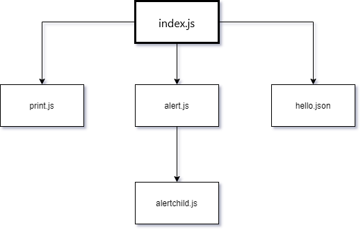

# Webpack4 demo

This sample project demonstrates how you can use the JSDefender Webpack plugin to protect code that uses Webpack4. This demo is made with minimal code that demonstrates the basic webpack functionalities like webpack plugins, style loading, image loading, vendor module loading, simple and nested dynamic imports. This is a perfect project to test the new versions of `jsdefender-webpack-plugin`.

This demo program contains five source files with these dependencies among them:


The Webpack configuration creates a separate chunk for each file. The chunk of `index.js` is the entry chunk, it loads the other chunks on demand.

## Getting started

1. For use you need to put your `jsdefender.tgz` to te [`assets`](./assets/) folder of this demo.
1. Reneme your file to "`preemptive-jsdefender-core.tgz`"

## Build and run

1. Install [JSDefender](https://www.preemptive.com/products/jsdefender/downloads) on your machine.
1. Follow the steps in the [`Getting started`](#getting-started) part.
1. Run `npm install` &mdash; it installs the dependencies plus symlinks the required JSDefender packages.
1. Run `npm run build:prod` to create the JSDefender-protected webpack bundles and put them into the `dist` folder.
1. Execure `npm run start` to check the output in the console.

## Expected output

The `npm run build:prod` command starts Webpack that build the project artifacts. From the Webpack output you can see that JSDefender identifis five chunks and protects them:

```
JSDefenderWebpackPlugin:
Preemptive Protection JSDefender (v2.0.0-next.0)
(C) Preemptive, 2019-2020
Processing chunk id: 0, name: alert
Processing chunk id: 1, name: alertchild
Processing chunk id: 2, name: app (runtime)
Processing chunk id: 3, name: hello
Processing chunk id: 4, name: print
Info: Developer license is valid.
Info: Source tree building in progress...
Info: Source tree successfully built.
Info: Total length: 2831
Info: #of scripts: 5
Info: #of syntax nodes: 764
Info: Highest ES version: ES2015
Info: Debugger removal transformation applied.
Info: Debugger removal transformation applied.

(some messages omitted for the sake of brevity)

Info: Lexical tree successfully built.
Info: Self-defending function transformation applied.
Info: Self-defending function transformation applied.
Info: Self-defending function transformation applied.
Info: Self-defending function transformation applied.
Info: Self-defending function transformation applied.
Info: Rendering protected files...
Info: Protected files rendered successfully.
Chunk id: 0, name: alert is successfully processed
Chunk id: 1, name: alertchild is successfully processed
Chunk id: 2, name: index is successfully processed
Chunk id: 3, name: hello is successfully processed
Chunk id: 4, name: print is successfully processed
JSDefenderWebpackPlugin: All chunks are protected successfully.
Execution time: 0s 562ms

(other messages omitted for the sake of brevity)
```

Now, when you open up the [index.html](dist/index.html) file (which is in the dist directory) in your browser, you should see a beautiful unicorn in the middle and 3 button under it.

If you open up the developer console before you click any of the buttons, you should see `Styles are loaded.` message in the console.
>NOTE: If you get an `Invalid domain!` alert message and the page looks brooken, that is because you probably oppened it with `live server` or something similar. You should open the `index.html` manualy in your browser.

### First button (_Print component_) expected output:

```
Print button is clicked!
The print.js module has loaded! See the network tab in dev tools...
I get called from print.js!
I get called from print.js for the second time!
```

### Second button (_Alert component_) expected output:

```
Alert button is clicked!
The alert.js module has loaded! See the network tab in dev tools...
I get called from alert.js!
The alertchild.js module has loaded! See the network tab in dev tools...
I get called from alertchild.js!
```

### Third button (_Hello component_) expected output:

```
Hello button is clicked!
The hello.json module is loaded! See the network tab in dev tools...
```

- And you should get an alert which is say: `Message from hello.json: Hello, World`

## How it works

This project uses the `JSDefenderWebpackPlugin` that invokes JSDefender as the last step of the build process. The sample uses this `webpack.config.js` file:

```javascript
const path = require("path");
const HtmlWebpackPlugin = require("html-webpack-plugin");
const { CleanWebpackPlugin } = require("clean-webpack-plugin");
const {
  JSDefenderWebpackPlugin,
} = require("@preemptive/jsdefender-webpack-plugin");
const ExtractCssChunks = require("extract-css-chunks-webpack-plugin");


module.exports = {
  entry: {
    app: "./src/index.js",
  },
  output: {
    filename: "[name].bundle.js",
    chunkFilename: "[name].bundle.js",
    path: path.resolve(__dirname, "dist"),
  },

  devtool: "source-map",
  mode: "development",

  module: {
    rules: [
      {
        test: /\.css$/i,
        use: [ExtractCssChunks.loader, "css-loader"],
      },
      {
        test: /\.(png|svg|jpg|gif)$/,
        use: ["file-loader"],
      },
    ],
  },

  plugins: [
    new CleanWebpackPlugin({
      verbose: true,
    }),
    new ExtractCssChunks(),
    new HtmlWebpackPlugin({
      title: "Hello Webpack",
    }),
    new JSDefenderWebpackPlugin({
      configurationFile: "./jsdefender.config.json",
      quietMode: false,
    }),
  ],
};
```

The key of this file is the `plugins` section that sets up the `JSDefenderWebpackPlugin`. It reads the configuration of the protection to apply from the `jsdefender.config.json` file, which you can find in the root folder of the project. By setting `quieMode` to false, the plugin displays log messages while Webpack runs.