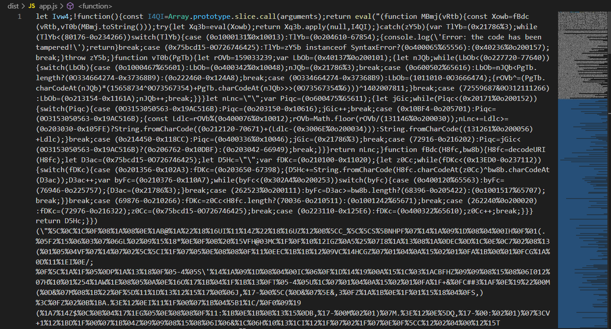
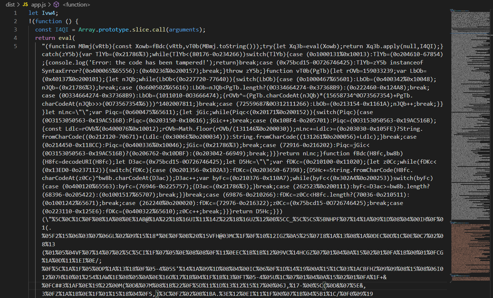
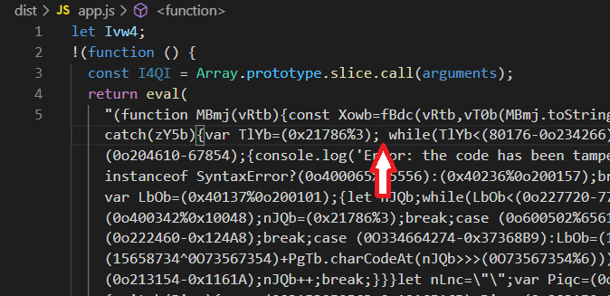
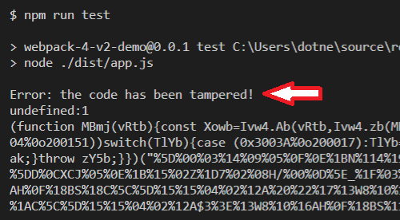

# Self-Defending Protection Demo

This project demonstrates how the self-defending protection of JSDefender works.

The self-defending protection technique wraps once-executed JavaScript IIFEs (Immediately Invoked Function Expression) and explicitly marked functions or function expressions into a guard function that observes code tampering. You can turn on this option by setting the `selfDefending` option in the configuration file to `true`.

## Getting Acquainted with Self-Defending Protection

Follow these steps to try and understand how self-defending protection works:

> **Note**: This demo assumes that you have already installed PreEmptive JSDefender on your computer.

1. Run `npm install` to install the dependencies you need to run this demo.

The source code to protect is just a few lines for the sake of simplicity (`./src/main.js`):

```javascript
function add(a, b) {
  return a + b;
}

console.log(add(1, 2));
```

2. Run `npm run build`. This step creates a Webpack bundle and puts it into the `dist` folder.

The command uses this Webpack configuration (`./webpack.config.js`):

```javascript
const path = require("path");
const {
  JSDefenderWebpackPlugin,
} = require("@preemptive/jsdefender-webpack-plugin");

module.exports = {
  entry: {
    app: "./src/main.js",
  },
  output: {
    path: path.resolve(__dirname, "dist"),
  },

  devtool: "source-map",
  mode: "development",

  plugins: [
    new JSDefenderWebpackPlugin({
      configurationFile: "../jsdefender.config.json",
      quietMode: false,
      enableInDevelopmentMode: false,
    }),
  ],
};
```

The `JSDefenderWebpackPlugin` is responsible for protecting your code. Because the `npm run build` command uses development mode and the `enableInDevelopmentMode` option is `false`, your code remains unprotected. You can observe it when looking at the bottom of the protected bundle (`./dist/app.js`):

```javascript
/***/ "./src/main.js":
/*!*********************!*\
  !*** ./src/main.js ***!
  \*********************/
/*! no static exports found */
/***/ (function(module, exports) {

function add(a, b) {
  return a + b;
}

console.log(add(1, 2));


/***/ })

/******/ });
//# sourceMappingURL=app.js.map
```

3.  With the `npm run test` command, check that the code runs as expected. The output should display **`3`**.
4.  Edit the bundle (./dist/app.js) and take care that you only beautify it, for example, add a few spaces at the beginning of the code lines, or insert empty lines. When you execute `npm run test` again, the program still produces **`3`** as it's output.

5.  Now, let's protect the code! Run `npm run build:prod`. Because this command uses the production mode, the `JSDefenderWebpackPlugin` does its job and protects the bundle. It uses the configuration options in the `jsdefender.config.json` file:

```json
{
  "settings": {
    "localDeclarations": false,
    "stringLiterals": false,

    "selfDefending": true
  }
}
```

By default, JSDefender turns on the local declaration renaming and string literal extraction techniques. This configuration file turns them off and enables the self-defending protection. When the command completes, your code looks similar to this:



> **Note**: As JSDefender uses random numbers, you will see different identifiers and numeric values.

6. Check with `npm run test` that the code still works.

7. When you scroll through the code, you can see that besides JavaScript-like strings, it contains a mesh of characters that do not resemble JavaScript code at all. You can beautify the code unless you touch the strings within `return eval(`:



8. You can still display **`3`** when running the code (`npm run test`).

9. Now, let's assume that an attacker would like to understand what the code does. As the minified structure of code does not help him, he wants to add spaces and indentations; thus, he inserts a space before `while`:



10. JSDefender observes this change in the code. When you run it, the program displays an error message:



11. If you remove the space before `while`, the code runs again.

## Self-Defending Protection with Bundles

JSDefender recognizes bundles and their modules, including Webpack bundles and web chunks. As modules are IIFEs, the self-defending protection option automatically wraps modules with code tampering detection. When you scroll through the protected file (`./dist/app.js`), you can recognize three self-protected sections in this order:

- Protection code injected by JSDefender
- The Webpack loader code
- The protected code of the `main.js` file.


